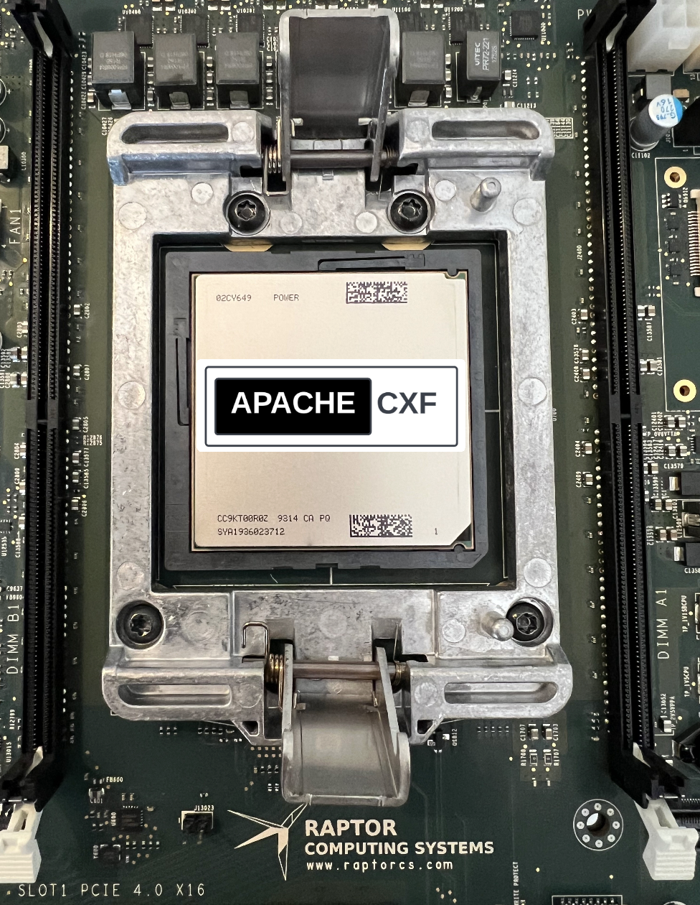

# Apache CXF on PPC64LE

<figure>

</figure>

The upcoming release of Apache CXF 4.1 will establish strong build and
runtime compatibility with JVMs running Linux on POWER.

## So which JVMs has Apache CXF been curated to work well upon PPC64LE?

- Adoptium Eclipse Temurin

- IBM Semeru

- RedHat OpenJDK

These are the three distributions which provide PPC64LE support.

Asoprium Eclipse Temurin and RedHat OpenJDK are both OpenJDK based, with
IBM Semuru using OpenJ9.

## What is special about running on PPC64LE?

<table>
<colgroup>
<col style="width: 33%" />
<col style="width: 33%" />
<col style="width: 33%" />
</colgroup>
<tbody>
<tr>
<td style="text-align: left;"><figure>

</figure></td>
<td style="text-align: left;"><figure>

</figure></td>
<td style="text-align: left;"><figure>

</figure></td>
</tr>
<tr>
<td style="text-align: left;">
x86-64 instruction set, commonly
supporting SMT, Efficient and Perforamnce cores available on some
implementations.
</td>
<td style="text-align: left;">
ARM cores providing reduced instruction
sets. Efficient and Perforamnce cores available on some
implementations.
</td>
<td style="text-align: left;">
PPC64LE cores with optional use of SMT4
or SMT8 for greater thread count.
</td>
</tr>
<tr>
<td style="text-align: left;">
Mobile, Desktop, and Server
oriented.
</td>
<td style="text-align: left;">
Mobile oriented, with Server
implementations becoming more common.
</td>
<td style="text-align: left;">
Workstation, Server oriented.
</td>
</tr>
</tbody>
</table>

In the case of our lab PPC64LE machine, its a Raptor Computing Systems'
Blackbird running an IBM POWER9 v2 CPU on CentOS Stream 9.

- 8 cores per package

  - 3.45GHz base / 3.8GHz turbo (WoF)

  - 160W TDP

  - All Core Turbo capable

  - 32KB L1 data cache + 32KB L1 instruction cache / core

  - 512KB unpaired L2 cache / core

  - 10MB unpaired L3 cache / core

- 14nm FinFET process

- SMT4 capable

- POWER IOMMU

- Hardware virtualization extensions

- Ultravisor functionality

- Hardware watchpoint support

CentOS Stream 9 is run in little Endian mode (the LE in PPC64LE), as are
the JVMs.

## Let’s take a look through the journey towards stable support.

Our journey began with a project to record our internal lab build
results on each [Apache CXF
release](https://github.com/savoirtech/apache-cxf-report). It quickly
became clear that there were issues in obtaining a full clean build of
the project. We began the process of addressing these issues with the
community. As we assisted in making the require changes, we endevoured
to ensure other platform/JVMs were not affected.

| Jira Entry | Errata |
|----|----|
| CXF-8994 | [CorbaConduitTest no longer requires IBM JDK destination activation routine.](https://issues.apache.org/jira/browse/CXF-8994) Older versions of IBM Java would require destinations to be activated ahead of test cases, that is no longer the case, as such we removed this behavoir. |
| CXF-8996 | [JAXRS Bean introspection utility Beanspector relies on Class.getMethods natural order.](https://issues.apache.org/jira/browse/CXF-8996) We discovered that JAXRS Bean introspection utility Beanspector relies on Class.getMethods natural order. For most JVMs the Beanspector Tests will pass, however IBM Semeru does not return methods in the same ordering. Note: Class.getMethods does not provide a prescribed ordering of methods. We applied ordering to methods such that all JVMs tested would achieve the same results. |
| CXF-8997 | [AbstractSTSTokenTest and TransportBindingTests no longer need to set https protocol to TLSv1 on IBM Java.](https://issues.apache.org/jira/browse/CXF-8997) IBM JDKs disable TLSv1 by default since around Java 8 (<https://community.ibm.com/community/user/wasdevops/blogs/hiroko-takamiya1/2021/06/19/ibm-java-80630-disables-tlsv1-tlsv11-by-default-ho>). Removing the test case IBM control flag allows the default TLS to pass the tests. |
| CXF-8999 | [KerberosTokenTest testKerberosViaCustomTokenAction should not run on IBM Java.](https://issues.apache.org/jira/browse/CXF-8999) The test case fails on ClassNotFound com.ibm.security.jgss.InquireType - this is thrown due to wss4j-ws-security-common having a hard coded check for IBM Java to use the above mentioned class. A future improvement would be to update wss4j-ws-security-common to be IBM Semeru friendly, then update CXF accordingly. |
| CXF-9002 | [JAXRSMultithreadedClientTest test cases failing on IBM JDK.](https://issues.apache.org/jira/browse/CXF-9002) This is was addressed via updates for Multi threading stability in other cards. |
| CXF-9006 | [TrustedAuthorityValidatorCRLTest#testIsCertChainValid fails when using Red Hat OpenJDK on PPC64LE.](https://issues.apache.org/jira/browse/CXF-9006). This card required updating the certificates stored in the system tests folder. |
| CXF-9014 | [org.apache.cxf.systest.ws.action.SignatureWhitespaceTest test fail on RH OpenJDK.](https://issues.apache.org/jira/browse/CXF-9014). Certificated used in the system test was updated from 1024-bit RSA key (weak) to RSA 2048/sha256. |

In our builds towards stable PPC64LE support, Apache CXF 4.1 will ship
with its internal performance script. Using this script we’ve been able
to run JAX-RS, and JAX-WS workflows to help stress the JVM, and identify
runtime issues.

## Reaching Out

Please do not hesitate to reach out with questions and comments, here on
the Blog, or through the Savoir Technologies website at
<https://www.savoirtech.com>.

## With Thanks

Thank you to the Apache CXF community for assisting in bringing
stability to Apache CXF on PPC64LE.

\(c\) 2024 Savoir Technologies
