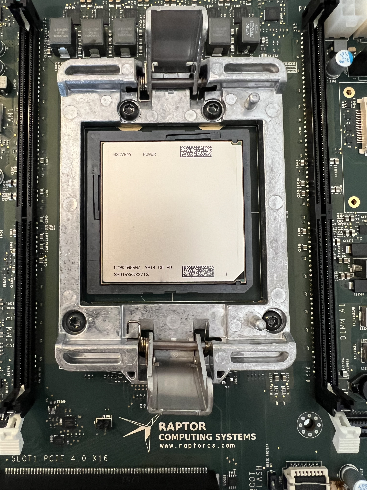

== Apache CXF on PPC64LE

The upcoming release of Apache CXF 4.1 will establish strong build and runtime compatibility with JVMs running Linux on POWER.



=== So which JVMs has Apache CXF been curated to work well upon PPC64LE? 

* Adoptium Eclipse Temurin
* IBM Semeru
* RedHat OpenJDK

These are the three distributions which provide PPC64LE support.


Asoprium Eclipse Temurin and RedHat OpenJDK are both OpenJDK based, with IBM Semuru using OpenJ9. 

=== What is special about running on PPC64LE?

[cols="1,1,1"]
|===

a| image::./assets/images/x64.png[alt=x64]
a| image::./assets/images/arm.png[alt=arm]
a| image::./assets/images/power.png[alt=power]

| x86-64 instruction set, commonly supporting SMT, Efficient and Perforamnce cores available on some implementations.
| ARM cores providing reduced instruction sets. Efficient and Perforamnce cores available on some implementations.
| POWER cores with optional use of SMT4 or SMT8 for greater thread count.

| Mobile, Desktop, and Server oriented.
| Mobile oriented, with Server implementations becoming more common.
| Workstation, Server oriented.

|===

=== Let’s take a look through the journey towards stable support.

[cols="1,1"]
|===
| Jira Entry | Errata

| https://issues.apache.org/jira/browse/CXF-8994[CorbaConduitTest no longer requires IBM JDK destination activation routine.]
| placeholder

| https://issues.apache.org/jira/browse/CXF-8996[JAXRS Bean introspection utility Beanspector relies on Class.getMethods natural order.]
| placeholder

| https://issues.apache.org/jira/browse/CXF-8997[AbstractSTSTokenTest and TransportBindingTests no longer need to set https protocol to TLSv1 on IBM Java.]
| placeholder

| https://issues.apache.org/jira/browse/CXF-8999[KerberosTokenTest testKerberosViaCustomTokenAction should not run on IBM Java.]

| placeholder

| https://issues.apache.org/jira/browse/CXF-9002[JAXRSMultithreadedClientTest test cases failing on IBM JDK.]
| placeholder

| https://issues.apache.org/jira/browse/CXF-9006[TrustedAuthorityValidatorCRLTest#testIsCertChainValid fails when using Red Hat OpenJDK on PPC64LE.]
| placeholder

| https://issues.apache.org/jira/browse/CXF-9014[org.apache.cxf.systest.ws.action.SignatureWhitespaceTest test fail on RH OpenJDK.]
| placeholder

|===

In our builds towards stable PPC64LE support, Apache CXF 4.1 will ship with its internal performance script. 
Using this script we’ve been able to run JAX-RS, and JAX-WS workflows to help stress the JVM, and identify runtime issues.
